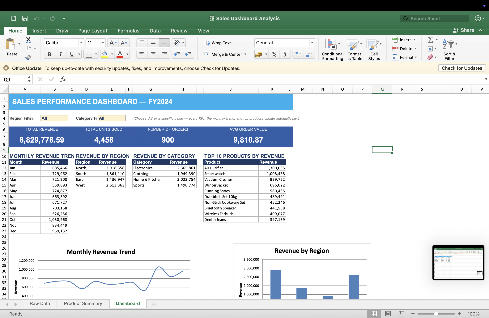
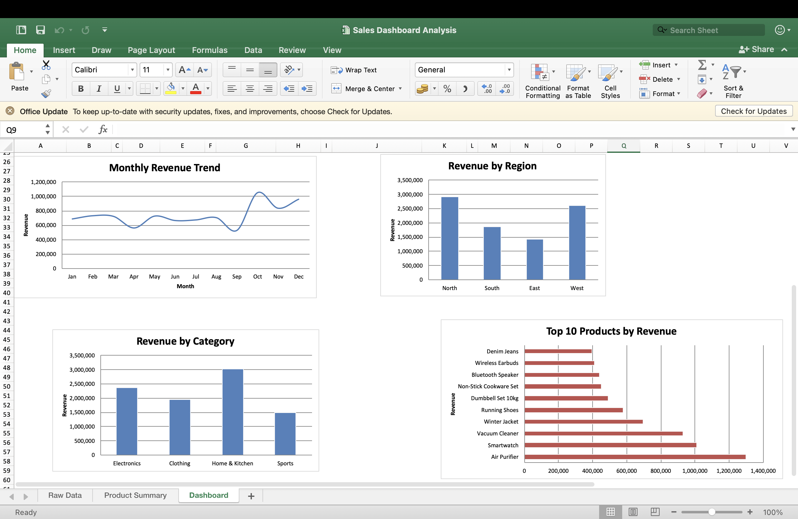
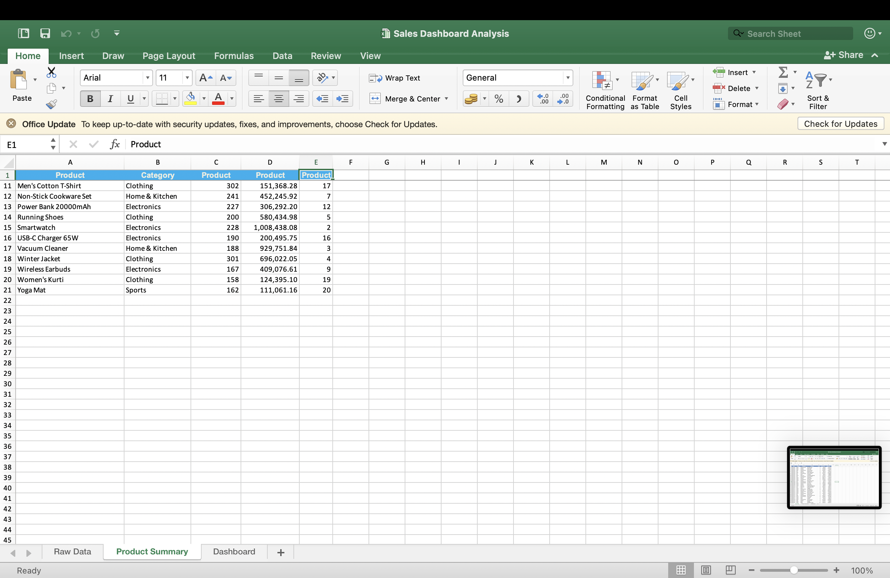
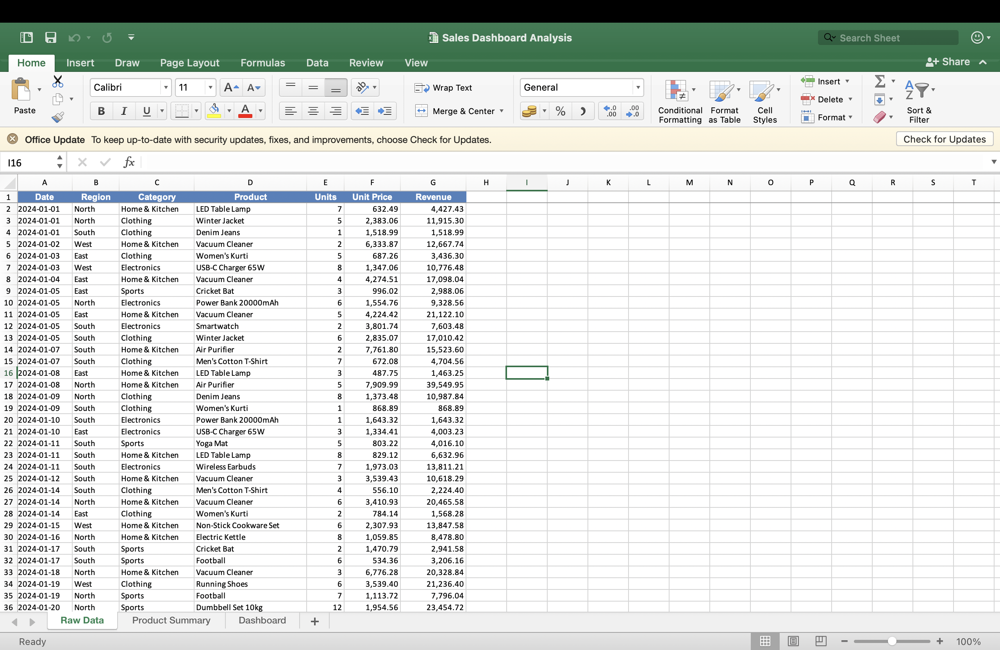

# 📊 Sales Dashboard Analysis

An interactive Excel dashboard that analyzes sales performance by **region**, **product category**, and **time period** — built as part of the SkillInfyTech Data Analytics Internship.


## 🎯 Objective
Create a dashboard that turns raw transaction-level sales data into visual, decision-ready business insights — total revenue, monthly trends, and top-selling products — filterable by region and category.

## 🖼️ Screenshots

| Dashboard Overview | Dashboard Charts |
|---|---|
|  |  |

| Product Summary | Raw Data |
|---|---|
|  |  |

## 🧰 Tools & Skills Used
- **Excel** — SUMPRODUCT/SUMIF-driven KPIs, dropdown-based filters (acting as slicers), pivot-style aggregation, native charts
- **Python (pandas)** — synthetic dataset generation (900 transactions, FY2024)
- **openpyxl** — programmatic workbook construction & formula writing

## 📁 Project Structure
```
sales-dashboard-analysis/
├── README.md
├── generate_data.py
├── build_workbook.py
├── sales_raw.csv
├── Sales Dashboard Analysis.xlsx
├── dashboard overview.png
├── dashboard charts.png
├── product summary.png
├── raw data.png
└── requirements.txt
```

## 📑 Dataset
900 synthetic sales transactions across FY2024 — 4 regions (North, South, East, West), 4 categories (Electronics, Clothing, Home & Kitchen, Sports), and 20 products. Generated with `generate_data.py` (no real company data used); includes seasonal patterns (e.g. holiday spike in Electronics/Clothing during Oct–Dec).

## ⚙️ How It Works
1. **Raw Data** sheet holds every transaction; `Revenue = Units × Unit Price` is a live formula.
2. **Product Summary** sheet aggregates revenue/units per product and ranks them (`RANK` + tie-break) to power the Top 10 Products chart via `INDEX`/`MATCH`.
3. **Dashboard** sheet has two dropdown filters (Region, Category). Every KPI and the monthly trend use `SUMPRODUCT` formulas that check the filter cells — so the whole dashboard updates live, the same way a Power BI slicer would, built natively in Excel.

## 📈 Key Insights
- **Home & Kitchen** is the top-grossing category, driven largely by the Air Purifier and Vacuum Cleaner.
- Revenue **peaks in October–December**, consistent with holiday-season demand in Electronics and Clothing.
- **North** is the strongest region by revenue; **East** lags behind — a potential focus area for regional sales strategy.
- Top 3 products (Air Purifier, Smartwatch, Vacuum Cleaner) account for a disproportionate share of total revenue — a classic 80/20 pattern worth flagging to inventory/marketing teams.

## 🚀 How to Run
```bash
pip install pandas openpyxl
python generate_data.py      # creates sales_raw.csv
python build_workbook.py     # creates Sales_Dashboard_Analysis.xlsx
```
Then open `Sales_Dashboard_Analysis.xlsx` in Excel and try changing the Region/Category dropdowns on the Dashboard sheet.

---
<div align="center">

### 📊 Sales Dashboard Analysis

Made with by **Sarthak Atri** | Excel • Python • Data Analysis

</div>
